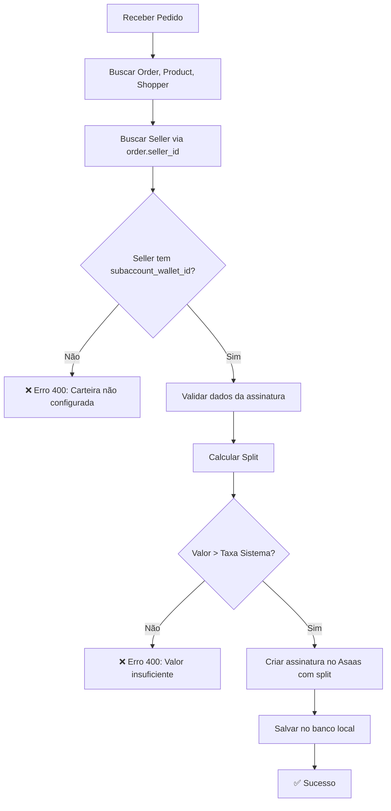

# Sistema de Divisão de Receitas (Split) - Assinaturas Shopper

## 📋 Visão Geral

O sistema de split implementa a **divisão obrigatória de receitas** entre a plataforma e os sellers para todas as assinaturas de shoppers. Esta funcionalidade garante que a plataforma receba sua taxa operacional automaticamente, enquanto o restante é direcionado para a carteira digital do seller no Asaas.

## 🎯 Características Principais

- ✅ **Split Obrigatório**: Todas as assinaturas de shopper DEVEM ter split configurado
- ✅ **Validação de Carteira**: Seller precisa ter `subaccount_wallet_id` configurado
- ✅ **Dois Modos de Cálculo**: Taxa fixa ou percentual (configurável via `.env`)
- ✅ **Bloqueio Automático**: Assinatura não é criada se seller não tiver carteira
- ✅ **Arquitetura SOLID**: Lógica isolada em `SplitCalculatorService` para facilitar manutenção

## 🔧 Configuração

### Variáveis de Ambiente

Adicione as seguintes variáveis no arquivo `.env`:

```env
# Split: Taxa Fixa (em Reais)
# Se configurado, a plataforma retém este valor fixo e o seller recebe o restante
AS_SPLIT_SYSTEM_FIXED=2.00

# Split: Taxa Percentual (em %)
# Se > 0, sobrescreve a taxa fixa
# A plataforma retém X%, o seller recebe (100 - X)%
AS_SPLIT_SYSTEM_PERCENT=0
```

### Regras de Prioridade

1. **Se `AS_SPLIT_SYSTEM_PERCENT > 0`**: Usa split percentual (ignora `AS_SPLIT_SYSTEM_FIXED`)
2. **Senão**: Usa split fixo com valor de `AS_SPLIT_SYSTEM_FIXED`

## 📊 Exemplos de Cálculo

### Modo: Taxa Fixa (Padrão)

```env
AS_SPLIT_SYSTEM_PERCENT=0
AS_SPLIT_SYSTEM_FIXED=2.00
```

| Valor Total | Sistema | Seller |
|------------|---------|--------|
| R$ 25,00   | R$ 2,00 | R$ 23,00 |
| R$ 100,00  | R$ 2,00 | R$ 98,00 |
| R$ 10,00   | R$ 2,00 | R$ 8,00 |

**Validação**: Valor total DEVE ser maior que `AS_SPLIT_SYSTEM_FIXED`

### Modo: Taxa Percentual

```env
AS_SPLIT_SYSTEM_PERCENT=10
AS_SPLIT_SYSTEM_FIXED=2.00  # Ignorado quando PERCENT > 0
```

| Valor Total | Sistema (10%) | Seller (90%) |
|------------|---------------|--------------|
| R$ 25,00   | R$ 2,50      | R$ 22,50     |
| R$ 100,00  | R$ 10,00     | R$ 90,00     |
| R$ 10,00   | R$ 1,00      | R$ 9,00      |

**Validação**: `AS_SPLIT_SYSTEM_PERCENT` DEVE ser < 100

## 🔒 Validações Implementadas

### 1. Seller com Carteira Obrigatória

```javascript
// ❌ Falha: Seller sem subaccount_wallet_id
{
  "success": false,
  "status": 400,
  "message": "Seller não possui carteira configurada (subaccount_wallet_id). Split é obrigatório para criar assinaturas."
}
```

### 2. Valor Mínimo (Taxa Fixa)

```javascript
// ❌ Falha: Valor R$ 2,00 com taxa fixa de R$ 2,00
{
  "success": false,
  "status": 400,
  "message": "Valor da assinatura (R$ 2.00) deve ser maior que a taxa do sistema (R$ 2.00)"
}
```

### 3. Percentual Inválido

```javascript
// ❌ Falha: AS_SPLIT_SYSTEM_PERCENT=100 ou maior
{
  "success": false,
  "status": 400,
  "message": "Percentual do sistema deve ser menor que 100%"
}
```

### 4. Valor Inválido

```javascript
// ❌ Falha: Valor null, undefined, 0 ou negativo
{
  "success": false,
  "status": 400,
  "message": "Valor da assinatura deve ser maior que zero"
}
```

## 🏗️ Arquitetura

### SplitCalculatorService

Serviço isolado responsável por toda a lógica de cálculo e validação de split.

```javascript
const SplitCalculatorService = require('./services/split-calculator.service');

// Validar seller
const validation = SplitCalculatorService.validateSellerForSplit(seller);
if (!validation.success) {
  return validation.error;
}

// Calcular split
const splitResult = SplitCalculatorService.calculateSplit(
  totalValue,
  seller.subaccount_wallet_id
);

if (!splitResult.success) {
  return splitResult.error;
}

// splitResult.split contém o array pronto para enviar ao Asaas
asaasSubscriptionData.split = splitResult.split;
```

### Estrutura do Split no Asaas

#### Split Fixo

```json
{
  "split": [
    {
      "walletId": "7b3b92a0-4d11-4e22-a3f4-3bd76abc11ff",
      "fixedValue": 23.00
    }
  ]
}
```

#### Split Percentual

```json
{
  "split": [
    {
      "walletId": "7b3b92a0-4d11-4e22-a3f4-3bd76abc11ff",
      "percentualValue": 90
    }
  ]
}
```

## 🧪 Testes

### Cobertura de Testes

O `SplitCalculatorService` possui **31 testes** cobrindo:

- ✅ Cálculo de split fixo (9 testes)
- ✅ Cálculo de split percentual (7 testes)
- ✅ Validação de wallet (3 testes)
- ✅ Validação de seller (5 testes)
- ✅ Configuração via environment variables (3 testes)
- ✅ Edge cases e cenários extremos (4 testes)

### Executar Testes

```bash
# Todos os testes
npm test

# Apenas testes do SplitCalculatorService
npm test -- __tests__/services/split-calculator.service.test.js

# Apenas testes de shopper subscription (inclui integração com split)
npm test -- __tests__/services/shopper.subscription.service.test.js
```

## 🚀 Fluxo de Criação de Assinatura



## 📝 Logs de Depuração

O sistema gera logs detalhados durante o cálculo de split:

```javascript
// Split Fixo
DEBUG - Split fixo aplicado: {
  sysFixed: 2,
  sellerFixed: 23,
  walletId: '7b3b92a0-4d11-4e22-a3f4-3bd76abc11ff'
}

// Split Percentual
DEBUG - Split percentual aplicado: {
  totalValue: 100,
  systemPercent: 10,
  sellerPercent: 90,
  walletId: '7b3b92a0-4d11-4e22-a3f4-3bd76abc11ff'
}
```

## 🔄 Integração com Asaas

### Resposta da API Asaas

Quando uma assinatura com split é criada com sucesso, o Asaas retorna:

```json
{
  "id": "sub_gnl7ku1hkcjn3u53",
  "customer": "cus_000007092080",
  "value": 25.00,
  "split": [
    {
      "walletId": "7b3b92a0-4d11-4e22-a3f4-3bd76abc11ff",
      "fixedValue": 23,
      "percentualValue": null,
      "status": "ACTIVE"
    }
  ],
  "status": "ACTIVE"
}
```

## ⚠️ Troubleshooting

### Problema: "Seller não possui carteira configurada"

**Causa**: O seller não tem `subaccount_wallet_id` no banco de dados.

**Solução**:
1. Verificar se o seller tem subconta no Asaas
2. Configurar `subaccount_wallet_id` no registro do seller:

```sql
UPDATE sellers 
SET subaccount_wallet_id = 'wallet-id-do-asaas' 
WHERE id = 1;
```

### Problema: "Valor da assinatura deve ser maior que a taxa"

**Causa**: O valor da assinatura é <= `AS_SPLIT_SYSTEM_FIXED`.

**Solução**:
- Aumentar o valor da assinatura, ou
- Reduzir `AS_SPLIT_SYSTEM_FIXED` no `.env`, ou
- Usar split percentual em vez de fixo

### Problema: Testes falhando após mudanças

**Causa**: Mocks não incluem `seller_id` no Order ou `subaccount_wallet_id` no Seller.

**Solução**: Atualizar mocks nos testes:

```javascript
// Mock do Order deve incluir seller_id
Order.findByPk.mockResolvedValue({
  id: 1,
  product_id: 1,
  shopper_id: 1,
  seller_id: 1,  // ⚠️ Obrigatório!
  value: 25.00
});

// Mock do Seller deve incluir wallet
Seller.findByPk.mockResolvedValue({
  id: 1,
  subaccount_wallet_id: '7b3b92a0-4d11-4e22-a3f4-3bd76abc11ff'  // ⚠️ Obrigatório!
});
```

## 🔐 Segurança

- ✅ Split é calculado **server-side**, não pode ser manipulado pelo cliente
- ✅ Validações duplas: no service e no calculador
- ✅ Transações de banco garantem atomicidade (rollback em caso de erro)
- ✅ Logs não expõem informações sensíveis (uso de `redactSensitive()`)

## 📚 Referências

- [Documentação Asaas - Split de Pagamentos](https://docs.asaas.com/reference/criar-assinatura)
- Código: `services/split-calculator.service.js`
- Testes: `__tests__/services/split-calculator.service.test.js`
- Serviço Principal: `services/shopper-subscription.service.js`

---

**Última Atualização**: Janeiro 2025  
**Versão**: 1.0.0  
**Autor**: Sistema de Assinaturas Nexos App
